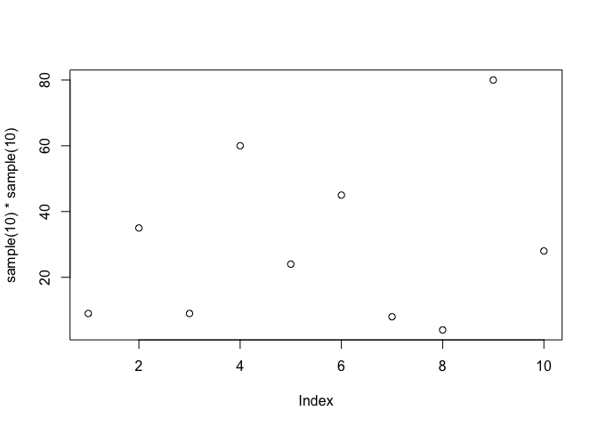

```r
paste("This is my fight code.  My happy git code.")
```

```
## [1] "This is my fight code.  My happy git code."
```

```r
sample(10) * sample(10)
```

```
##  [1] 48 45 18 63  7 20  5  8 24 40
```

```r
plot(sample(10) * sample(10))
```

<!-- -->

